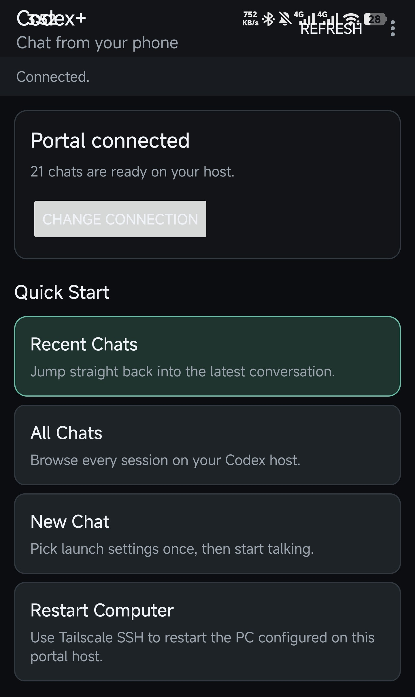
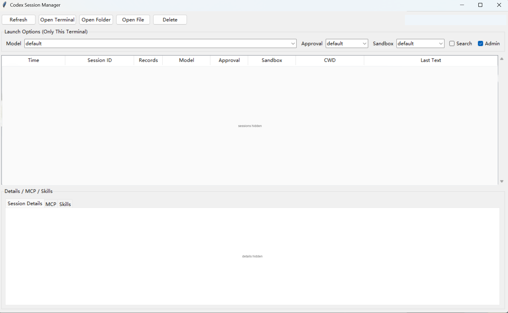
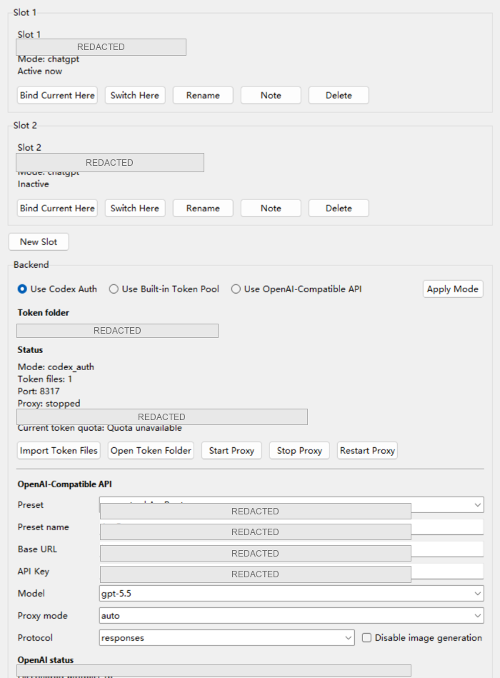

# Codex+

Codex+ 是一个面向 Windows 的 Codex 会话管理工具。它把本机 Codex CLI 会话、桌面管理器、手机网页入口和 Android 客户端放在一起，适合在电脑上跑 Codex，同时用手机查看会话、继续对话、停止回复或远程重启主机。

这个项目按“本地优先”设计。仓库不内置你的 API Key、Codex 登录文件、账号 token、代理列表、机器码或私人服务配置；这些内容都应保存在本机 `%USERPROFILE%\.codex\...` 或其他本地目录中。

## 界面预览

手机端首页：



桌面端概览：



账号与后端配置：



## 核心功能

- 桌面端浏览、搜索和继续本机 Codex 会话。
- 在指定目录启动新 Codex 会话。
- 手机浏览器或 Android APP 连接电脑上的 mobile portal。
- 手机上查看最近会话、全部会话、新建会话、停止回复。
- 支持图片输入，OpenAI-Compatible 模式下会维护模型的图片输入元数据。
- 支持三种后端模式：
  - `Codex Auth`：使用本机 Codex CLI 登录状态。
  - `Built-In Token Pool`：读取本机 token 文件并通过本地代理转发。
  - `OpenAI-Compatible API`：使用你本机保存的兼容 API 预设。
- 每个 OpenAI-Compatible 预设可以配置模型、协议、代理策略、跳过验证、安装 ID、Claude 环境变量补丁，以及是否禁用图片生成。
- 可以通过 LAN、Tailscale 或自己的域名访问手机端。
- 可选通过 SSH/Tailscale 重启另一台电脑。

## 手机 APP 在哪里

仓库里保留了一个可直接安装的 debug APK：

```text
app/CodexPlus-debug.apk
```

Android 项目源码在：

```text
android-app/
```

如果只想使用手机端，也可以不安装 APP，直接在手机浏览器打开 `run-mobile.bat` 打印出来的 portal URL。

## 项目结构

```text
.
├─ app.py                         # Windows 桌面管理器
├─ mobile_portal.py               # 手机网页入口和 Android APP 调用的本地服务
├─ token_pool_proxy.py            # Built-In Token Pool 本地代理
├─ custom_provider_proxy.py       # OpenAI-Compatible 协议适配代理
├─ token_pool_settings.py         # 后端模式、API 预设和本地配置读写
├─ auth_slots.py                  # Codex 账号槽位管理
├─ controlled_browser.py          # 受控浏览器辅助逻辑
├─ process_singleton.py           # 启动时清理同项目旧进程
├─ remote_ssh.py                  # 远程重启相关 SSH 逻辑
├─ session_context_repair.py      # 会话上下文修复辅助
├─ run.bat                        # 启动桌面端
├─ run-mobile.bat                 # 启动手机 portal
├─ app/
│  └─ CodexPlus-debug.apk         # Android debug 安装包
├─ android-app/                   # Android APP 源码
├─ assets/
│  ├─ mobile-home.jpg             # 手机端展示图
│  └─ ui-overview.png             # 桌面端展示图
└─ scripts/
   └─ ensure-boot-network.ps1     # 启动网络辅助脚本
```

为了让公开仓库更清爽，测试文件和开发计划文档没有保留在主分支里。核心运行文件、Android 源码、APK 和展示图片保留。

## 快速开始

### 1. 准备环境

需要：

- Windows 10/11
- Python 3.11 或更新版本
- Codex CLI 已安装并在 `PATH` 中可用
- Tkinter，通常随官方 Python 安装

先确认 Codex CLI 可用：

```powershell
codex --version
codex login
```

### 2. 启动桌面端

```bat
run.bat
```

桌面端用于浏览会话、打开账号管理、选择后端模式、配置 OpenAI-Compatible API 预设。

### 3. 启动手机端服务

```bat
run-mobile.bat
```

启动后终端会打印手机访问地址，类似：

```text
http://192.168.x.x:8765/?token=...
```

把这个地址复制到手机浏览器，或者在 Android APP 中填写 portal 地址和 token。

## 后端模式说明

### Codex Auth

使用本机 Codex CLI 的正常登录状态。适合已经通过 `codex login` 登录的用户。

### Built-In Token Pool

读取本机 token 文件并启动本地代理。默认 token 文件目录是：

```text
%USERPROFILE%\.cli-proxy-api
```

这些 token 文件是私人数据，不应提交到 GitHub。

### OpenAI-Compatible API

用于兼容 OpenAI/Codex 请求格式的第三方服务。预设保存在本机：

```text
%USERPROFILE%\.codex\token_pool_settings.json
```

每个预设可配置：

- Base URL
- API Key
- Model
- Responses 或 Chat Completions 协议
- direct/proxy/auto 代理策略
- 是否跳过验证
- 是否禁用图片生成
- installation_id 和 Claude 环境变量补丁

公开仓库不包含任何预设、Key 或私人 URL。

## 手机访问方式

### 同一局域网

电脑和手机在同一 Wi-Fi 下，直接使用 `run-mobile.bat` 打印出的 LAN URL。

### Tailscale

电脑和手机加入同一个 tailnet 后，可以使用 Tailscale 地址访问 portal。

### 自有域名

可以用 Cloudflare Tunnel、Nginx、Caddy 等把 HTTPS 域名转发到：

```text
http://127.0.0.1:8765
```

注意：

- `token` 是访问凭证，不要公开。
- 公开域名必须使用 HTTPS。
- 不要把 portal 无 token 暴露到公网。

## Android APP 构建

本机已验证可用的 Gradle 路径：

```text
C:\Users\MECHREVO\.gradle\wrapper\dists\gradle-9.0.0-bin\d6wjpkvcgsg3oed0qlfss3wgl\gradle-9.0.0\bin\gradle.bat
```

构建命令：

```powershell
cd android-app
$env:ANDROID_HOME='C:\Users\MECHREVO\AppData\Local\Android\Sdk'
$env:ANDROID_SDK_ROOT='C:\Users\MECHREVO\AppData\Local\Android\Sdk'
& 'C:\Users\MECHREVO\.gradle\wrapper\dists\gradle-9.0.0-bin\d6wjpkvcgsg3oed0qlfss3wgl\gradle-9.0.0\bin\gradle.bat' :app:assembleDebug --console=plain
```

构建输出通常在：

```text
android-app\app\build\outputs\apk\debug\app-debug.apk
```

仓库中提供的安装包是：

```text
app\CodexPlus-debug.apk
```

## 本地私人配置

这些文件只应保存在本机，不要提交到 GitHub：

```text
%USERPROFILE%\.codex\auth.json
%USERPROFILE%\.codex\config.toml
%USERPROFILE%\.codex\token_pool_settings.json
%USERPROFILE%\.codex\mobile_portal_settings.json
%USERPROFILE%\.codex\installation_id
%USERPROFILE%\.cli-proxy-api\...
```

不要提交：

- API Key
- OAuth access token / refresh token
- Codex auth 文件
- token pool 文件
- SSH 私钥、密码
- 代理列表
- 个人域名、内网 IP、机器码
- 本机特殊 provider 配置

## 发布说明

当前仓库没有使用 GitHub Releases。安装包直接放在：

```text
app/CodexPlus-debug.apk
```

如果以后要正式发布，可以再启用 GitHub Releases 或 CI 构建流程。
